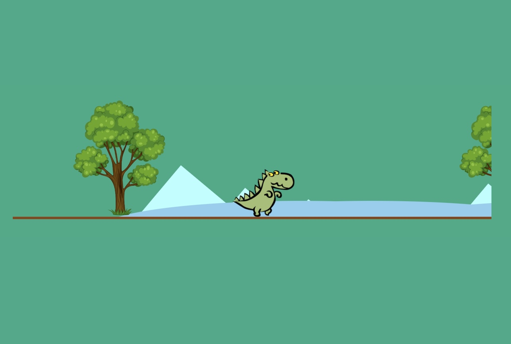

# Dino Animation CSS 🦕 

Welcome to the Dino Animation using CSS! 🌄🏃‍♂️

## Preview

## How to view? 🎮
To view the animation, simply open the `index.html` file in your web browser. The game will start automatically, and you can sit back and enjoy the animated landscape. The dinosaur will continuously run across the screen, creating an immersive experience.

## Features ✨
- **Dynamic Landscape**: The animation displays a visually appealing landscape with mountains, hills, trees, rocks, and a running dinosaur.
- **Smooth Animation**: The animations are implemented using CSS keyframes and transitions, providing a smooth and realistic movement for the dinosaur and other elements.
- **Responsive Design**: The game is designed to adapt to different screen sizes, ensuring an optimal viewing experience on both desktop and mobile devices.

## Installation ⚙️
To run the code locally, follow these steps:
1. Clone this repository to your local machine or download the source code as a ZIP file.
2. Open the `index.html` file in your preferred web browser.
3. The game will start automatically, and you can enjoy the animation.

## Dependencies 📦
The game does not have any external dependencies. It is built using HTML and CSS only, making it lightweight and easy to run.

## License 📄
The Dino Animation Game is released under the [MIT License](LICENSE), granting you the freedom to modify and distribute the game. However, please provide attribution to the original author by linking back to the GitHub repository.

Well, I hope you enjoy the Dino Animation! Have fun playing and feel free to contribute to the project or customize it according to your needs. 🎉
